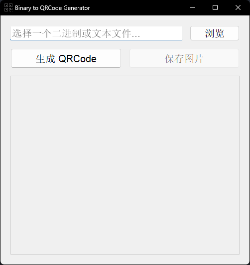
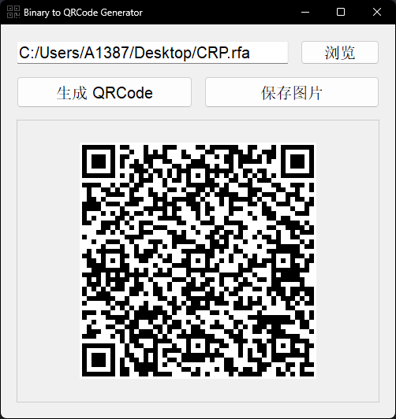

# Lab2QRCode

一个在 windows 中可以将任意二进制文件转为 `QRCode` 的项目。

基于 [zxing-cpp](https://github.com/zxing-cpp/zxing-cpp) 实现核心功能。

为了保证兼容性，会将二进制文件先转为 `base64`，以防止一些控制字符等不被 zxing-cpp 支持；然后再交给 zxing-cpp 转为 `QRCode`。

## 构建

它使用 `cmake` 管理项目，依赖项：

- **[`zxing-cpp`](https://github.com/zxing-cpp/zxing-cpp)**
- **`OpenCV4`**
- **`Qt5`**

## 使用

1. 打开软件

   

2. 点击浏览选择二进制或文本文件，然后点击“生成QRCode”按钮即可生成图片

   

